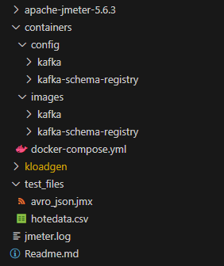

# Kafka Avro/JSON Schema-Registry Performance Testing

This project provides a comprehensive example of how to perform performance testing on Apache Kafka using JMeter with both Avro and JSON serialization formats. The setup is designed to help you evaluate and compare the throughput and efficiency of Kafka when using different message serialization strategies.

Included in this demo is a fully configured Docker environment that launches Kafka brokers and a Schema Registry, ensuring you can quickly spin up all required components for testing. Alongside the core services, the repository provides sample tools and scripts for generating test data, sending messages, and measuring key performance metrics such as throughput and latency.

By following this example, you can easily set up controlled performance benchmarks for your own Kafka deployments, analyze the impact of serialization choices, and gain deeper insights into how Avro and JSON perform under varying workloads. This setup is ideal for developers, data engineers, or anyone looking to validate the performance of their streaming infrastructure in a reproducible, automated manner.

## Features

- Docker containers for Kafka and Confluent Schema Registry
- JMeter test setup with KLoadGen (Kafka Load Generator)
- Example schemas for both Avro and JSON formats
- Sample test data representing hotel reviews
- Pre-configured test plan (.jmx file)
- High-partition topic configuration (72 partitions) to test scalability
- Step-by-step instructions for deployment and execution

---

## Architecture



---

## Setup Instructions

1. **Start all services:**
    ```bash
    docker-compose up -d --build
    ```

2. **Download JMeter and Compile KLoadGen:**
    ```bash
    chmod +x jmeter_install.sh
    ./jmeter_install.sh
    ```

3. **Register Schemas with Schema Registry**
    **Register AVRO Schema:**
    ```bash
    curl -X POST -H "Content-Type: application/vnd.schemaregistry.v1+json" \
    --data '{
    "schema": "{\"type\":\"record\",\"name\":\"HotelReview\",\"namespace\":\"com.hotel.reviews\",\"fields\":[{\"name\":\"review_id\",\"type\":\"string\"},{\"name\":\"hotel_id\",\"type\":\"string\"},{\"name\":\"user_id\",\"type\":\"string\"},{\"name\":\"rating\",\"type\":\"float\"},{\"name\":\"review_date\",\"type\":{\"type\":\"string\",\"logicalType\":\"date\"}},{\"name\":\"stay_duration\",\"type\":\"int\"},{\"name\":\"traveler_type\",\"type\":\"string\"},{\"name\":\"room_type\",\"type\":\"string\"},{\"name\":\"title\",\"type\":\"string\"},{\"name\":\"review_text\",\"type\":\"string\"},{\"name\":\"helpful_votes\",\"type\":\"int\"},{\"name\":\"location_score\",\"type\":\"float\"},{\"name\":\"service_score\",\"type\":\"float\"},{\"name\":\"cleanliness_score\",\"type\":\"float\"},{\"name\":\"value_score\",\"type\":\"float\"},{\"name\":\"is_verified\",\"type\":\"boolean\"},{\"name\":\"language\",\"type\":\"string\"},{\"name\":\"country_origin\",\"type\":\"string\"},{\"name\":\"has_response\",\"type\":\"boolean\"},{\"name\":\"booking_channel\",\"type\":\"string\"}]}"
    }' \
    http://localhost:18081/subjects/hoteldata_avro-value/versions
    ```

    **Register JSON Schema:**
    ```bash
    curl -X POST -H "Content-Type: application/vnd.schemaregistry.v1+json" \
    --data '{
    "schemaType": "JSON",
    "schema": "{\"$schema\":\"http://json-schema.org/draft-07/schema#\",\"title\":\"HotelReview\",\"type\":\"object\",\"properties\":{\"review_id\":{\"type\":\"string\"},\"hotel_id\":{\"type\":\"string\"},\"user_id\":{\"type\":\"string\"},\"rating\":{\"type\":\"number\"},\"review_date\":{\"type\":\"string\",\"format\":\"date\"},\"stay_duration\":{\"type\":\"integer\"},\"traveler_type\":{\"type\":\"string\"},\"room_type\":{\"type\":\"string\"},\"title\":{\"type\":\"string\"},\"review_text\":{\"type\":\"string\"},\"helpful_votes\":{\"type\":\"integer\"},\"location_score\":{\"type\":\"number\"},\"service_score\":{\"type\":\"number\"},\"cleanliness_score\":{\"type\":\"number\"},\"value_score\":{\"type\":\"number\"},\"is_verified\":{\"type\":\"boolean\"},\"language\":{\"type\":\"string\"},\"country_origin\":{\"type\":\"string\"},\"has_response\":{\"type\":\"boolean\"},\"booking_channel\":{\"type\":\"string\"}},\"required\":[\"review_id\",\"hotel_id\",\"user_id\",\"rating\",\"review_date\"]}"
    }' \
    http://localhost:18081/subjects/hoteldata_json-value/versions
    ```

4. **Create Kafka Topics:**
    **Create Kafka Topics:**
    ```bash
    docker exec -it kafka1 /opt/kafka/bin/kafka-topics.sh --create --topic hotel-avro --bootstrap-server kafka1:9092,kafka2:9092,kafka3:9092 --partitions 32 --replication-factor 3 --config min.insync.replicas=2

    docker exec -it kafka1 /opt/kafka/bin/kafka-topics.sh --create --topic hotel-json --bootstrap-server kafka1:9092,kafka2:9092,kafka3:9092 --partitions 32 --replication-factor 3 --config min.insync.replicas=2
    ```

    **Check These Schema in Kafka-UI:**
    ```bash
    localhost:8080
    ```

5. **Create Sample Data:**
    You can find the sample data in the test_file folder. JMeter uses KLoadGen to loop over the sample data, so using just a single line of data is perfectly fine. No need to worry!

    1. Start JMeter:
    ```bash
    ./apache-jmeter-5.6.3/bin/jmeter
    ```

    2. Load the test plan:
    ```bash
    File → Open → test_file → avro_json.jmx
    ```

    3. Update avro_json.jmx:
    ```bash
    Update the hotel.csv data file path in JMeter, and feel free to modify any other settings in the GUI as needed.
    ```

    4. Start the test and monitor the results in the Summary Report.
    > Note: Do not use the GUI for performance testing!
    ```bash
    JVM_ARGS="-Xms4g -Xmx24g" ./apache-jmeter-5.6.3/bin/jmeter -n -t test_files/avro_json.jmx -l ./output/report.csv -e -o ./output/html_report/
    ```

    5. Check the Output:
    ```bash
    cat ./output/html_report/statis.json
    ```

---