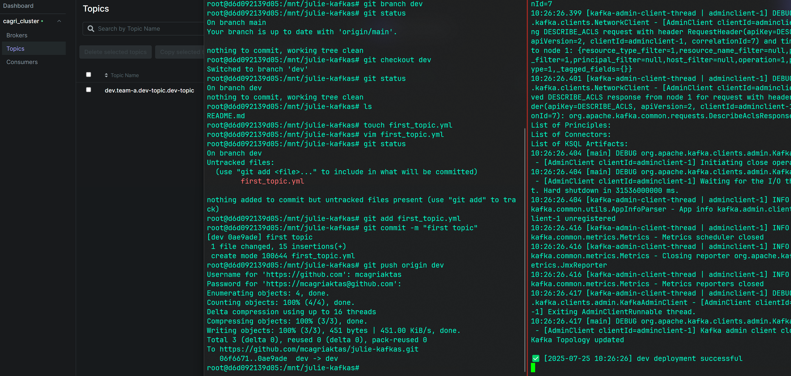

# GitOps Kafka Management with JulieOps

This project demonstrates how to manage Kafka topologies—including topics, ACLs, configurations, consumer groups, and more—by applying GitOps principles using JulieOps. With this setup, you can automate the configuration and management of your Kafka infrastructure directly through Git workflows, ensuring consistency, traceability, and easy rollbacks.

The demo showcases how JulieOps enables you to define Kafka resources as code and synchronize them with your clusters by simply pushing changes to a Git repository. The project also illustrates the use of branch-based environments, allowing you to manage multiple deployment environments (such as development, staging, and production) through Git branches. As a result, changes to your Kafka setup can be reviewed, versioned, and promoted using standard Git operations.

This approach streamlines Kafka administration, improves collaboration among team members, and brings modern DevOps best practices to event streaming infrastructure. The repository is ideal for teams looking to automate and standardize their Kafka management processes using a robust, Git-driven workflow.

> **Medium Article**: [How to Manage Kafka Topology with JulieOps]([https://medium.com/p/your-article-link](https://medium.com/@mucagriaktas/how-to-manage-kafka-topology-with-julieops-4903594b0307))


## Core Features
- Declarative Kafka configuration via YAML files
- Environment segregation (dev/stage/prod)
- Webhook-driven GitOps automation
- Approval workflow for production changes
- Kafka UI for monitoring
- Custom Docker setup for all components

## Services Overview

| Service Name      | Version | Description             | URLs                 | Ports  |
|-------------------|---------|--------------------------|----------------------|--------|
| Kafka             | 4.0.0   | Streaming platform       | kafka{1, 2, 3}:9092 | localhost:{19092, 29092, 39092}   |
| Kafka UI          | 0.7.2  | Web-based Kafka viewer   | http://localhost:8080| 8080   |
| Kafka JulieOps    | 4.4.1  | Kafka topology manager   | -                  | -   |
| Ngrok             | v3-stable-linux-amd64  | Tunnel to localhost      | http://localhost:4040| 4040   |
| Webhook Listener  | Python3  | GitHub webhook handler   | 0.0.0.0                | 8090   |

## Project Structure
```bash
├── config
│   ├── kafka-julie
│   │   ├── julie.properties
│   │   └── ngrok.yml.template
│   ├── kafka1
│   │   ├── kafka-metrics.yml
│   │   └── server.properties
│   ├── kafka2
│   │   ├── kafka-metrics.yml
│   │   └── server.properties
│   ├── kafka3
│   │   └── server.properties
│   ├── provectus
│   │   └── config.yml
│   └── team-a
│       ├── configs
│       │   └── push_yaml_to_repo.md
│       └── topologies
│           ├── dev
│           │   └── dev-topologies.yaml
│           ├── prod
│           │   └── prod-topologies.yaml
│           └── stage
│               └── stage-topology.yaml
├── container_images
│   ├── kafka
│   │   ├── Dockerfile
│   │   └── init-sh
│   │       └── kafka-starter.sh
│   ├── kafka-julie
│   │   ├── Dockerfile
│   │   └── init-sh
│   │       ├── kafka-julie-starter.sh
│   │       ├── ngrok.yaml
│   │       └── webhook-listener.py
│   ├── provectus
│   │   ├── Dockerfile
│   │   └── init-sh
│   │       └── starter-kafka-ui.sh
│   └── team-a
│       ├── Dockerfile
│       └── init-sh
│           └── machine-starter.sh
├── docker-compose.yml
└── logs
```

## 🚀 Quick Start
### Prerequisites
- Linux
- Docker & Docker Compose
- GitHub account
- [Ngrok account](https://ngrok.com) (free tier)

1. **Configure environment**:
    ```bash
    # GitHub Configuration
    github_username=your_github_username
    github_email=your_github_email
    github_repo=your_github_repository (only repository name example: https://github.com/mcagriaktas/julie-kafkas ==> julie-kafkas)
    github_token=your_classic_github_token

    # Ngrok Configuration
    ngrok_token=your_ngrok_token (https://dashboard.ngrok.com/get-started/your-authtoken)
    ```

2. **Build and start the demo**:
    ```bash
    docker-compose up -d
    ```

## ⚠️ Tips:
1. **How to Use Kafka-Julie:**
    ⚠️ The deployment includes a GitHub webhook, so you don't need to run kafka-julie manually. Check `images/init-sh/webhook-listener.py` for details.

    ```bash
    java -jar /opt/kafka_julie/julie-ops-4.4.1.jar \
        --brokers kafka1:9092,kafka2:9092,kafka3:9092 \
        --clientConfig /opt/kafka_julie/config/julie.properties \
        --topology your_topology.yml
    ```

1. **Accept the commit for the PROD environment**:
    You can find your ngrok_url in `/logs/kafka-julie/` or by running `docker logs kafka-julie`.
    ```bash
    curl -X GET $NGROK_URL$/deploy/prod
    ```

2. **Create 3 Branch in the Github Repository:**
    ```bash
    1. dev
    2. stage
    3. PROD
    ```

2. **How to push topologies from the team-a container to GitHub**:
    Think of it as a machine in your company, and another team wants to create or update a topic, etc.

    ```bash
    docker exec -it team-a bash

    git clone $repo_url

    cd $repo_url

    git checkout dev
    ```

    Then create a YAML file, you can find an example in the `configs/team-a/topologies` folder.

    ```bash
    vim your_yaml.yaml

    git add your_yaml.yaml

    git commit -m "first topic"

    git push origin dev
    ```

then check `docker logs kafka-julie` and `kafka-ui (localhost:8080)`



## Source:
- [Kafka Julie Github Repo](#https://github.com/kafka-ops/julie)
- [Kafka Julie Docs](#https://julieops.readthedocs.io/en/3.x/index.html)
