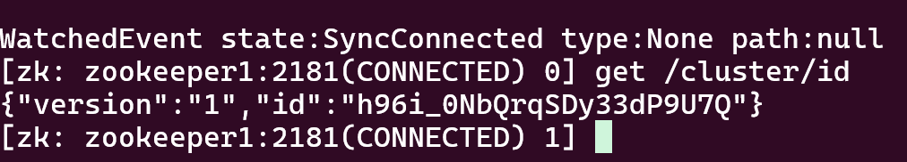
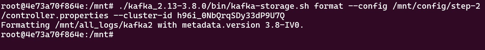
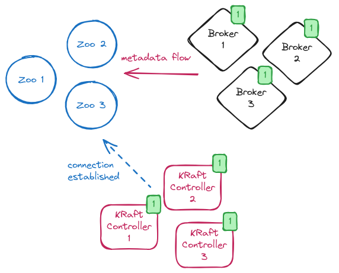

## End-To-End Zookeeper to KRaft Upgrade:
Kafka = 3.8.0
Zookeeper = 3.7.2

Kafka1:
```
ipv4_address: 172.80.0.10
````

Zookeeper1:
```
zookeeper1 = ipv4_address: 172.80.0.11
```

Kafka2:
```
kafka2 = ipv4_address: 172.80.0.12
```

Zookeeper2:
```
zookeeper2 = ipv4_address: 172.80.0.13
```

Kafka3:
```
kafka3 = ipv4_address: 172.80.0.14
```

Zookeeper3:
```
zookeeper3 = ipv4_address: 172.80.0.15
```

### Explanation
```bash
There are 3 Kafka brokers and 3 ZooKeepers. You don't need to change any *.properties files since I have set up step-1, step-2, and step-3, so each *.properties file has its own version.
```

## Setup Zokeeper:
In this section, we'll setup 3 ZooKeeper instances.

### Setup zookeeper1: 
```bash
docker exec -it zookeeper1 bash

mkdir -p /mnt/all_logs/zookeeper_data && echo "1" > /mnt/all_logs/zookeeper_data/myid
```

### Setup zookeeper2: 
```bash
docker exec -it zookeeper2 bash

mkdir -p /mnt/all_logs/zookeeper_data && echo "2" > /mnt/all_logs/zookeeper_data/myid
```

### Setup zookeeper3: 
```bash
docker exec -it zookeeper3 bash

mkdir -p /mnt/all_logs/zookeeper_data && echo "3" > /mnt/all_logs/zookeeper_data/myid
```

## Start Zookeeper:
In this part, we'll start 3 zookeeper instances and 3 brokers.

### Start Zookeeper For zookeeper1:
```bash
docker exec -it zookeeper1 bash

apache-zookeeper-3.7.2-bin/bin/zkServer.sh start
```

### Start the Zookeeper For zookeeper2:
```bash
docker exec -it zookeeper2 bash

apache-zookeeper-3.7.2-bin/bin/zkServer.sh start
```

### Start the Zookeeper For zookeeper3:
```bash
docker exec -it zookeeper3 bash

apache-zookeeper-3.7.2-bin/bin/zkServer.sh start
```

## Start Kafka
In this section, we'll start 3 kafka broker.

### Start Kafka For kafka1:
```bash
docker exec -it kafka1 bash

kafka_2.13-3.8.0/bin/kafka-server-start.sh /mnt/config/step-1/server.properties
```

### Start Kafka For kafka2:
```bash
docker exec -it kafka2 bash

kafka_2.13-3.8.0/bin/kafka-server-start.sh /mnt/config/step-1/server.properties
```

### Start Kafka For kafka3:
```bash
docker exec -it kafka3 bash

kafka_2.13-3.8.0/bin/kafka-server-start.sh /mnt/config/step-1/server.properties
```

## Create Topic then insert example data:
In this part we'll create a topic and insert some test data for migration.
You can create example data in either Kafka1, Kafka2 and Kafka3, it doesn't matter which one you will use, because our cluster is running right now.

```bash
docker exec -it kafka1 bash

kafka_2.13-3.8.0/bin/kafka-topics.sh --create --bootstrap-server localhost:9092,kafka2:9092,kafka3:9092 --topic test --partitions 3 --replication-factor 3

kafka_2.13-3.8.0/bin/kafka-console-producer.sh --bootstrap-server localhost:9092,kafka2:9092,kafka3:9092 --topic test

kafka_2.13-3.8.0/bin/kafka-console-consumer.sh --bootstrap-server localhost:9092,kafka2:9092,kafka3:9092 --topic test --from-beginning
```

## Upgrade
In this section, follow the steps outlined in `/mnt/config/step-1`, `/mnt/config/step-2`, and `/mnt/config/step-3`. There's no need to modify any `*.properties` files, as the demo will guide you through the migration process and indicate which `server.properties` metrics need to be enabled or disabled.

### Learn The Cluster ID in zookeeper1 or zookeeper2:
**P.S**: ZooKeeper1, ZooKeeper2 and Zookeeper3 are providing you with the same cluster ID.
```bash
docker exec -it zookeeper1 bash

apache-zookeeper-3.7.2-bin/bin/zkCli.sh -server zookeeper1:2181
```

> get /cluster/id
Example:
{"version":"1","id":"h96i_0NbQrqSDy33dP9U7Q"}



### Format the Logs folder the step-2 server.propertie for kafka1:
```bash
docker exec -it kakfa1 bash

./kafka_2.13-3.8.0/bin/kafka-storage.sh format --config /mnt/config/step-2/controller.properties --cluster-id h96i_0NbQrqSDy33dP9U7Q

Example:
Formatting /all_logs/kafka with metadata.version 3.8-IV0
```

### Format the Logs folder the step-2 server.propertie for kafka2:
```bash
docker exec -it kafka2 bash

./kafka_2.13-3.8.0/bin/kafka-storage.sh format --config /mnt/config/step-2/controller.properties --cluster-id h96i_0NbQrqSDy33dP9U7Q

Example:
Formatting /all_logs/kafka with metadata.version 3.8-IV0
```

### Format the Logs folder the step-2 server.propertie for kafka3:
```bash
docker exec -it kafka3 bash

./kafka_2.13-3.8.0/bin/kafka-storage.sh format --config /mnt/config/step-2/controller.properties --cluster-id h96i_0NbQrqSDy33dP9U7Q

Example:
Formatting /all_logs/kafka with metadata.version 3.8-IV0
```



## Start Controllers:
When starting the migration, the new KRaft Kafka version needs to run the controller. The controller will connect to ZooKeeper, retrieve metadata, and synchronize this data. For this reason, it is necessary to format the log-data path using the old cluster ID. 

We have already formatted the cluster ID for our new KRaft cluster.



Source=https://strimzi.io/blog/2024/03/21/kraft-migration/

[Check the DeepNotes[3]](#3)
### Start Kafka1 step-2 controller.properties file:
```bash
docker exec -it kakfa1 bash

kafka_2.13-3.8.0/bin/kafka-server-start.sh /mnt/config/step-2/controller.properties
```

### Start Kafka2 step-2 controller.properties file:
```bash
docker exec -it kafka2 bash

kafka_2.13-3.8.0/bin/kafka-server-start.sh /mnt/config/step-2/controller.properties
```

### Start Kafka3 step-2 controller.properties files for kakfa1:
```bash
docker exec -it kafka3 bash

kafka_2.13-3.8.0/bin/kafka-server-start.sh /mnt/config/step-2/controller.properties
```


## Start Brokers:
When starting the controller, we need to migrate step by step by shutting down each broker and then starting the new broker.

### Start Kafka1 with step-2 broker.properties files:
```bash
# Shut down Kafka1 Broker and start it using the new properties file located at /mnt/step-2/broker.properties.

docker exec -it kafka1 bash

kafka_2.13-3.8.0/bin/kafka-server-start.sh /mnt/config/step-2/broker.properties
```

### Start Kafka2 with step-2 broker.properties files:
```bash
# Shut down Kafka2 Broker and start it using the new properties file located at /mnt/step-2/broker.properties.

docker exec -it kafka2 bash

kafka_2.13-3.8.0/bin/kafka-server-start.sh /mnt/config/step-2/broker.properties
```

### Start Kafka3 with step-2 broker.properties files:
```bash
# Shut down Kafka3 Broker and start it using the new properties file located at /mnt/step-2/broker.properties.

docker exec -it kafka3 bash

kafka_2.13-3.8.0/bin/kafka-server-start.sh /mnt/config/step-2/broker.properties
```

## Check the logs to confirm that the migration is complete:
```bash
Completed migration of metadata from ZooKeeper to KRaft.

After this step, you need to stop your New broker and conroller, restart it with the new /mnt/step-3/*.properties file for each instance. 
```

### Broker Logs:


### Controller Logs:


## Start fully KRaft Cluster
In this step, you essentially need to restart all Kafka controllers and brokers.

## Restart Broker and Controller:
```
in this step you need to stop your kafka1, kafka2 and kafka3 broker and controller then restart with step-3 controller.propertie file. If you're using demon service, you need to basicly restart your broker. First, restart the controller, then the broker!
```

### Start Kafka1 step-3 controller.properties and broker.properties files:
```bash
docker exec -it kafka1 bash

kafka_2.13-3.8.0/bin/kafka-server-start.sh /mnt/config/step-3/broker.properties

kafka_2.13-3.8.0/bin/kafka-server-start.sh /mnt/config/step-3/controller.properties
```

### Start Kafka2 step-3 controller.properties and broker.properties files:
`in this step you need to stop your kafka2 controller then restart with step-3 controller.propertie file.`
```bash
docker exec -it kafka2 bash

kafka_2.13-3.8.0/bin/kafka-server-start.sh /mnt/config/step-3/broker.properties

kafka_2.13-3.8.0/bin/kafka-server-start.sh /mnt/config/step-3/controller.properties
```

### Start Kafka3 step-3 controller.properties and broker.properties files:
`in this step you need to stop your kafka3 controller then restart with step-3 controller.propertie file.`
```bash
docker exec -it kafak3 bash

kafka_2.13-3.8.0/bin/kafka-server-start.sh /mnt/config/step-3/broker.properties

kafka_2.13-3.8.0/bin/kafka-server-start.sh /mnt/config/step-3/controller.properties
```

## Fully KRaft:
### Final
`In this step, you're fully running the KRaft version`

### Stop zookeeper1:
```bash
docker exec -it zookeeper1 bash

apache-zookeeper-3.7.2-bin/bin/zkServer.sh stop
```

### Stop zookeeper2:
```bash
docker exec -it zookeeper2 bash

apache-zookeeper-3.7.2-bin/bin/zkServer.sh stop
```

### Stop zookeeper3:
```bash
docker exec -it zookeeper3 bash

apache-zookeeper-3.7.2-bin/bin/zkServer.sh stop
```

### Check your topic and data:
```bash
kafka_2.13-3.8.0/bin/kafka-console-consumer.sh --bootstrap-server localhost:9092,kafka2:9092,kafka3:9092 --topic test --from-beginning
```


**DeepNote:**
### [1]

```bash
WARN inter.broker.protocol.version is deprecated in KRaft mode as of 3.3 and will only be read when first upgrading from a KRaft prior to 3.3. See kafka-storage.sh help for details on setting the metadata.version for a new KRaft cluster. (kafka.server.KafkaConfig)
```

### [2]

```bash
You can upgrade from ZooKeeper to KRaft in the isolated mode with separate KRaft controller nodes and broker nodes.

You cannot migrate to the combined mode where KRaft and brokers are on the same process (role=controller, broker)
```
reference:https://docs.confluent.io/operator/current/co-migrate-kraft.html#:~:text=You%20can%20upgrade%20from%20ZooKeeper,migrated%20from%20ZooKeeper%20to%20KRaft.

### [3]
```bash
You'll see the High Watermark when you start the controller. Don't panic, as the controller is still searching for other controllers. Once all 3 controllers are started, the error log will disappear.

[2025-01-03 09:10:15,183] INFO [MetadataLoader id=3000] initializeNewPublishers: the loader is still catching up because we still don't know the high water mark yet. (org.apache.kafka.image.loader.MetadataLoader)
```
