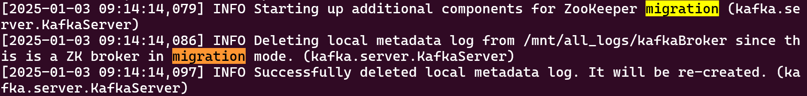
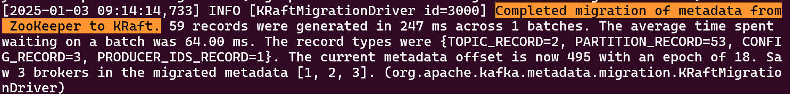
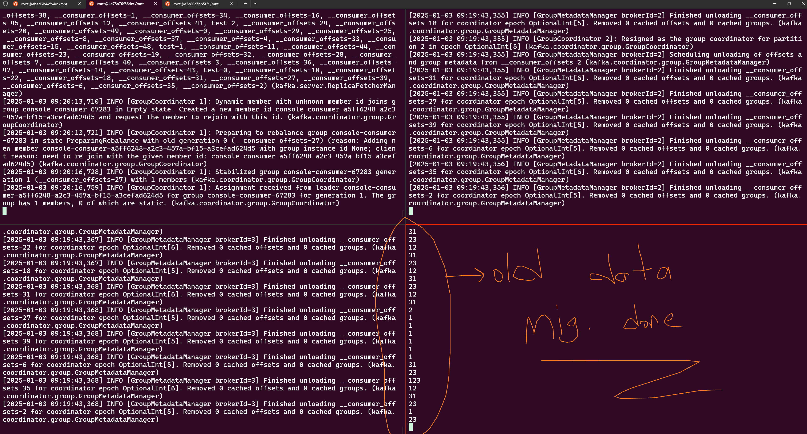

# End-To-End Zookeeper to KRaft Upgrade:
This deployment is specifically designed to help you migrate from Zookeeper-based Kafka clusters to KRaft mode. The setup provides a straightforward and easy-to-follow example, making it simple to understand each step involved in the migration process.

With this deployment, you can see how to upgrade your Kafka cluster from using Zookeeper to using the newer KRaft (Kafka Raft) mode, observing the key differences and workflow changes. Please note: This environment does not support SASL_SSL or any form of authentication. The migration process shown here uses PLAINTEXT communication only, which simplifies the setup but is not recommended for production environments.

It’s important to be aware that migrating with PLAINTEXT differs from migrating with SASL_SSL or other authentication methods. Some steps, configurations, or compatibility issues may only be relevant when security is enabled. This deployment is ideal for learning, experimenting, or testing the Zookeeper-to-KRaft upgrade flow in a basic, unsecured Kafka environment.

## Kafka and Zookeeper Versions:
```bash
Kafka = 3.8.0
Zookeeper = 3.7.2
```

### Explanation
```bash
There are 3 Kafka brokers and 3 ZooKeepers. You don't need to change any *.properties files since I have set up step-1, step-2, and step-3, so each *.properties file has its own version. 

Because KRaft migration has 3 step: 
1. Typly runnig kafka with zookeeper
2. Kafka run with controller and zookeeper (dual mode)
3. At the final kafka run only controller.
```

## Setup Zokeeper:
In this section, we'll setup 3 ZooKeeper instances. All zookeeper automaticly starting running when the `docker-compose up -d --build`.

## Start Kafka
In this section, we'll start 3 kafka broker.

### Start Kafka For kafka1:
```bash
docker exec -it kafka1 bash

kafka_2.13-3.8.0/bin/kafka-server-start.sh /mnt/properties/step-1/server.properties
```

### Start Kafka For kafka2:
```bash
docker exec -it kafka2 bash

kafka_2.13-3.8.0/bin/kafka-server-start.sh /mnt/properties/step-1/server.properties
```

### Start Kafka For kafka3:
```bash
docker exec -it kafka3 bash

kafka_2.13-3.8.0/bin/kafka-server-start.sh /mnt/properties/step-1/server.properties
```

### Restart Kafka-ui Container:
```bash
docker-compose restart kafka-ui
```

### Create Topic then insert example data:
In this part we'll create a topic and insert some test data for migration.
You can create example data in either Kafka1, Kafka2 and Kafka3, it doesn't matter which one you will use, because our cluster is running right now.

Can create topic in kafka-ui, `localhost:8080`:
```bash
topic-name: zk-to-kraft
number of partitions=12
min in sync replicas=2
replication Factor=3
```

### Start the sample data and check all the time python example data output in your terminal:
```bash
python data_generator/producer.py
```

### Find the current cluster ID:
```bash
## Upgrade
In this section, follow the steps outlined in `/mnt/properties/step-1`, `/mnt/properties/step-2`, and `/mnt/properties/step-3`. There's no need to modify any `*.properties` files, as the demo will guide you through the migration process and indicate which `server.properties` metrics need to be enabled or disabled.

### Learn The Cluster ID in zookeeper1 or zookeeper2:
**P.S**: ZooKeeper1, ZooKeeper2 and Zookeeper3 are providing you with the same cluster ID.
```bash[]
docker exec -it zookeeper1 bash

apache-zookeeper-3.7.2-bin/bin/zkCli.sh -server zookeeper1:2181
```

> get /cluster/id
Example:
{"version":"1","id":"FerdygTKSceXXk4TAzVMyA"}


### Format the Logs folder the step-2 server.propertie for kafka1:
```bash
docker exec -it kafka1 bash

./kafka_2.13-3.8.0/bin/kafka-storage.sh format --config /mnt/properties/step-2/controller.properties --cluster-id FerdygTKSceXXk4TAzVMyA

Example:
Formatting /all_logs/kafka with metadata.version 3.8-IV0
```

### Format the Logs folder the step-2 server.propertie for kafka2:
```bash
docker exec -it kafka2 bash

./kafka_2.13-3.8.0/bin/kafka-storage.sh format --config /mnt/properties/step-2/controller.properties --cluster-id FerdygTKSceXXk4TAzVMyA

Example:
Formatting /all_logs/kafka with metadata.version 3.8-IV0
```

### Format the Logs folder the step-2 server.propertie for kafka3:
```bash
docker exec -it kafka3 bash

./kafka_2.13-3.8.0/bin/kafka-storage.sh format --config /mnt/properties/step-2/controller.properties --cluster-id FerdygTKSceXXk4TAzVMyA

Example:
Formatting /all_logs/kafka with metadata.version 3.8-IV0
```


## Start Controllers:
When starting the migration, the new KRaft Kafka version needs to run the controller. The controller will connect to ZooKeeper, retrieve metadata, and synchronize this data. For this reason, it is necessary to format the log-data path using the old cluster ID. 

We have already formatted the cluster ID for our new KRaft cluster.


[Check the DeepNotes[1]](#1)
### Start Kafka1 step-2 controller.properties file:
```bash
docker exec -it kafka1 bash

kafka_2.13-3.8.0/bin/kafka-server-start.sh /mnt/properties/step-2/controller.properties
```

### Start Kafka2 step-2 controller.properties file:
```bash
docker exec -it kafka2 bash

kafka_2.13-3.8.0/bin/kafka-server-start.sh /mnt/properties/step-2/controller.properties
```

### Start Kafka3 step-2 controller.properties files for kakfa1:
```bash
docker exec -it kafka3 bash

kafka_2.13-3.8.0/bin/kafka-server-start.sh /mnt/properties/step-2/controller.properties
```


## Start Brokers:
When starting the controller, we need to migrate step by step by shutting down each broker and then starting the new broker.

### Start Kafka1 with step-2 broker.properties files:
```bash
# Shut down Kafka1 Broker and start it using the new properties file located at /mnt/step-2/broker.properties.

docker exec -it kafka1 bash

kafka_2.13-3.8.0/bin/kafka-server-start.sh /mnt/properties/step-2/broker.properties
```

### Start Kafka2 with step-2 broker.properties files:
```bash
# Shut down Kafka2 Broker and start it using the new properties file located at /mnt/step-2/broker.properties.

docker exec -it kafka2 bash

kafka_2.13-3.8.0/bin/kafka-server-start.sh /mnt/properties/step-2/broker.properties
```

### Start Kafka3 with step-2 broker.properties files:
```bash
# Shut down Kafka3 Broker and start it using the new properties file located at /mnt/step-2/broker.properties.

docker exec -it kafka3 bash

kafka_2.13-3.8.0/bin/kafka-server-start.sh /mnt/properties/step-2/broker.properties
```

## Check the logs to confirm that the migration is complete:
```bash
Completed migration of metadata from ZooKeeper to KRaft.

After this step, you need to stop your New broker and conroller, restart it with the new /mnt/step-3/*.properties file for each instance. 
```

### Broker Logs:


### Controller Logs:


## Start fully KRaft Cluster
In this step, you essentially need to restart all Kafka controllers and brokers.

## Restart Broker and Controller:
```
in this step you need to stop your kafka1, kafka2 and kafka3 broker and controller then restart with step-3 controller.propertie file. If you're using demon service, you need to basicly restart your broker. First, restart the controller, then the broker!
```

### Start Kafka1 step-3 controller.properties and broker.properties files:
```bash
docker exec -it kafka1 bash

kafka_2.13-3.8.0/bin/kafka-server-start.sh /mnt/properties/step-3/controller.properties

kafka_2.13-3.8.0/bin/kafka-server-start.sh /mnt/properties/step-3/broker.properties
```

### Start Kafka2 step-3 controller.properties and broker.properties files:
`in this step you need to stop your kafka2 controller then restart with step-3 controller.propertie file.`
```bash
docker exec -it kafka2 bash

kafka_2.13-3.8.0/bin/kafka-server-start.sh /mnt/properties/step-3/controller.properties

kafka_2.13-3.8.0/bin/kafka-server-start.sh /mnt/properties/step-3/broker.properties
```

### Start Kafka3 step-3 controller.properties and broker.properties files:
`in this step you need to stop your kafka3 controller then restart with step-3 controller.propertie file.`
```bash
docker exec -it kafak3 bash

kafka_2.13-3.8.0/bin/kafka-server-start.sh /mnt/properties/step-3/controller.properties

kafka_2.13-3.8.0/bin/kafka-server-start.sh /mnt/properties/step-3/broker.properties
```

## Fully KRaft:

### Check your topic and data:
```bash
Check your data in kafka-ui, `localhost:8080`
```



**DeepNote:**

### [1]
```bash
You'll see the High Watermark when you start the controller. Don't panic, as the controller is still searching for other controllers. Once all 3 controllers are started, the error log will disappear.

[2025-01-03 09:10:15,183] INFO [MetadataLoader id=3000] initializeNewPublishers: the loader is still catching up because we still don't know the high water mark yet. (org.apache.kafka.image.loader.MetadataLoader)
```
