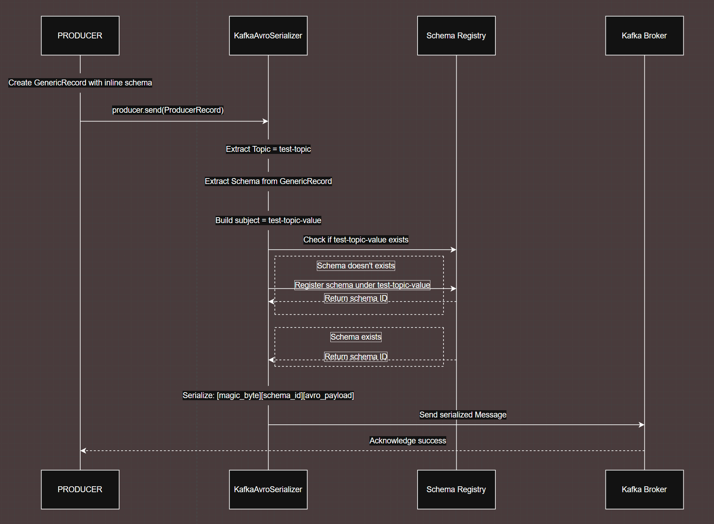

# Kafka Schema Registry Demo

This repository provides a comprehensive example project for working with Apache Kafka alongside the Confluent Schema Registry. The setup is designed to help you quickly get started with schema management and real-world event streaming using Avro serialization.

Included in this environment is a fully configured 3-node Kafka cluster and support for Avro serialization, allowing you to define and enforce data schemas for your Kafka topics. The project also features a modern Kafka UI (Provectus), accessible through your browser, making it easy to browse topics, inspect schemas, and monitor cluster activity.

Additionally, a sample Scala-based Avro producer is provided, demonstrating how to produce Avro-encoded messages to Kafka using the Schema Registry. With everything you need in a single package, this project is ideal for developers, data engineers, or anyone interested in learning about schema evolution, compatibility, and best practices in event-driven architectures.

---

## 📁 Project Structure

```
.
├── configs/
│   ├── kafka/
│   │   ├── kafka1/server.properties
│   │   ├── kafka2/server.properties
│   │   └── kafka3/server.properties
│   ├── kafka_schema_registry/
│   │   └── kafka_schema_registry.properties
│   └── provectus/
│       └── config.yml
├── data_generator/
│   ├── producer.py
├── docker-compose.yml
├── images/
│   ├── kafka/
│   ├── kafka_schema_registry/
│   └── provectus/
└── logs/
```

---
## 🌐 Key Endpoints

| Service        | URL                      | Description                  |
|----------------|--------------------------|------------------------------|
| Kafka UI       | http://localhost:8080    | Cluster web interface        |
| Schema Registry| http://localhost:18081   | Schema REST API              |
| Kafka Brokers  | localhost:19092,29092,39092 | Kafka endpoints           |


## What's Schema Registry

Schema Registry is a centralized service for managing and enforcing the structure (schema) of data sent to and read from Apache Kafka topics.
 - It stores schemas (e.g., Avro, JSON Schema, Protobuf) for Kafka message values and keys.
 - It validates that all data published to a topic conforms to the registered schema, preventing incompatible or corrupted data.
 - Schema Registry enables safe schema evolution (changing fields, adding types) by enforcing compatibility rules, so consumers and producers can be upgraded independently without breaking the pipeline.
 - The most common use case is with Avro serialization, but it also supports Protobuf and JSON Schema.

### 📚 Schema Registry Compatibility Levels

| Level                | Description                     | Use Case               |
|----------------------|---------------------------------|------------------------|
| **BACKWARD**         | New schema reads old data        | Upgrade consumers first|
| **FORWARD**          | Old schema reads new data        | Upgrade producers first|
| **FULL**             | Both directions compatible       | Max. safety            |
| **BACKWARD_TRANSITIVE** | Compatible with all previous   | Enterprise             |
| **FORWARD_TRANSITIVE**  | Compatible with all future     | Long-term              |
| **FULL_TRANSITIVE**     | All versions compatible        | Mission-critical       |
| **NONE**             | No compatibility checks          | Dev/testing            |

---

## 🚀 Quick Start

1. **Start all services:**

```bash
docker-compose up -d --build
```

2. **Create a Topic:**

Open Kafka UI at `localhost:8080`, create a topic (e.g. `test-topic`).

---

3. **Register Avro Schema:**

#### Option A: Kafka UI
1. Navigate to `localhost:8080` → Schema Registry.
2. Add schema for subject: `test-topic-value`:
   ```json
   {
     "type": "record",
     "name": "Data",
     "fields": [
       {"name": "name", "type": "string"},
       {"name": "age", "type": "int"},
       {"name": "city", "type": "string"}
     ]
   }
   ```

#### Option B: REST API
```bash
curl -X POST http://localhost:18081/subjects/test-topic-value/versions \
  -H "Content-Type: application/vnd.schemaregistry.v1+json" \
  -d '{
    "schema": "{\"type\":\"record\",\"name\":\"Data\",\"fields\":[{\"name\":\"name\",\"type\":\"string\"},{\"name\":\"age\",\"type\":\"int\"},{\"name\":\"city\",\"type\":\"string\"}]}"
  }'
```

---

4. **Run Avro Producer:**

```bash
python data_generator/producer_py
```



---


### Schema Evolution Example

**❌ Backward Incompatible**
> Change in data_generator/producer.py age type int to string.
```json
{"name": "age", "type": "string"}  // Was int before
```

---

### Schema Registry Commands
```bash
# List subjects
curl -X GET http://localhost:18081/subjects

# Get latest schema
curl -X GET http://localhost:18081/subjects/test-topic-value/versions/latest

# Check compatibility
curl -X GET http://localhost:18081/config/test-topic-value

# Delete schema version
curl -X DELETE http://localhost:18081/subjects/test-topic-value/versions/1
```

### Kafka-UI
- See your data in [Kafka UI - Schema Registry](http://localhost:8080/ui/clusters/cagri_cluster/schemas)

---