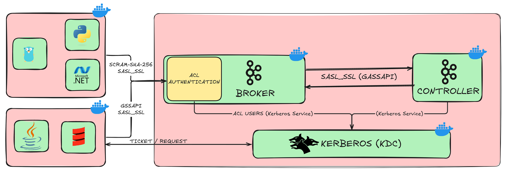
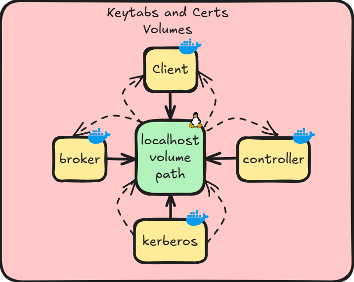

# Securing a Split KRaft Kafka Architecture: Setting Up Kerberos and SCRAM Authentication

In this demo, the main aim is to implement a split KRaft Kafka Cluster with separate controller and broker components. When authentication is added to the `*.properties` files, the split architecture can cause confusion, which is why I've set up `GSSAPI authentication` between the controller and broker. Additionally, a client container is included that uses both `Kerberos and SCRAM authentication` with the broker. For a deeper understanding of configuration, properties files, and `Kerberos/SCRAM authentication`, please refer to the accompanying `medium article`. 

---

Note: The Medium article was written a month ago, so some explanations might be slightly outdated or unclear. Please follow and review the current repository for the most accurate information. Of course, you can also read the Medium article for additional context.

---

Medium Article: https://medium.com/@mucagriaktas/securing-a-split-kraft-kafka-architecture-setting-up-kerberos-and-scram-authentication-665f310ec306



### 🛠️ Environment Setup
| Software          | Description                                    | Version                             | UI - Ports      |
|-------------------|------------------------------------------------|-------------------------------------|------------|
| **WSL**           | Windows Subsystem for Linux environment        | Ubuntu 22.04 (Distro 2)             |            |
| **Docker**        | Containerization platform                      | Docker version 27.2.0               |            |
| **Docker Compose**| Tool for defining and running multi-container Docker applications | v2.29.2-desktop.2 |            |
| **Apache Kafka**  | Distributed event streaming platform           | 3.9.0                               | 9092 (broker), 9093 (controller) 19092-29092-39092 (external) |
| **Kerberos**      | Network authentication protocol service        | MIT Kerberos version 1.19.2-2ubuntu0.5 | 88/udp (KDC), 749/tcp (kadmin) |
| **Python**        | Programming language                           | 3.9.2                               |            |
| **Scala**         | Programming language                           | 2.10.20                             |            |

# 🛠️ How to Start The Project
1. Build the images:
```bash
docker-compose up -d --build
```

### How to create Keytabs and Scrum Users for Client:
1. When you build and start the project, you can use the client (producer or consumer or stream) in the client container! 

2. You can simply use ./add_users.sh to create topics, consumer groups, SCRAM users, keytabs, and more. When you create keytabs, they will appear in the configs/keytabs/ directory. This path is shared as a volume between the Kerberos and client containers. Therefore, whenever you create a new keytab, it will automatically be available in that directory.

3. The deployment also has its own kafka-admin user. broker1 and controller1 have the kafka-admin keytab file. If you need to test using the kafka/bin tools, use: `--command-config /opt/kafka/config/gssapi-admin-client.properties`

4. Kafka Nodes

| Name         | Hostname     | DNS                         |
|--------------|--------------|-----------------------------|
| broker1      | broker1      | broker1.dahbest.kfn         |
| broker2      | broker2      | broker2.dahbest.kfn         |
| broker3      | broker3      | broker3.dahbest.kfn         |
| controller1  | controller1  | controller1.dahbest.kfn     |
| controller2  | controller2  | controller2.dahbest.kfn     |
| controller3  | controller3  | controller3.dahbest.kfn     |

---


Also when you want to compile a jar or write a new scrip, you can put your file in `/configs/client/scala or python`

client volume:
```bash
      - ./configs/client:/mnt/home
```



### DeepNote [1]
Note: If you want to run Kafka 3.9.0, you need to add controller.advertised.listener. Before Kafka 3.9.0, this was not required, but starting from version 3.9.0 and in future releases, Kafka explicitly requires it.

### Thanks for Helping and Contributing
## `Can Sevilmis & Bunyamin Onum & B. Can Sari`
