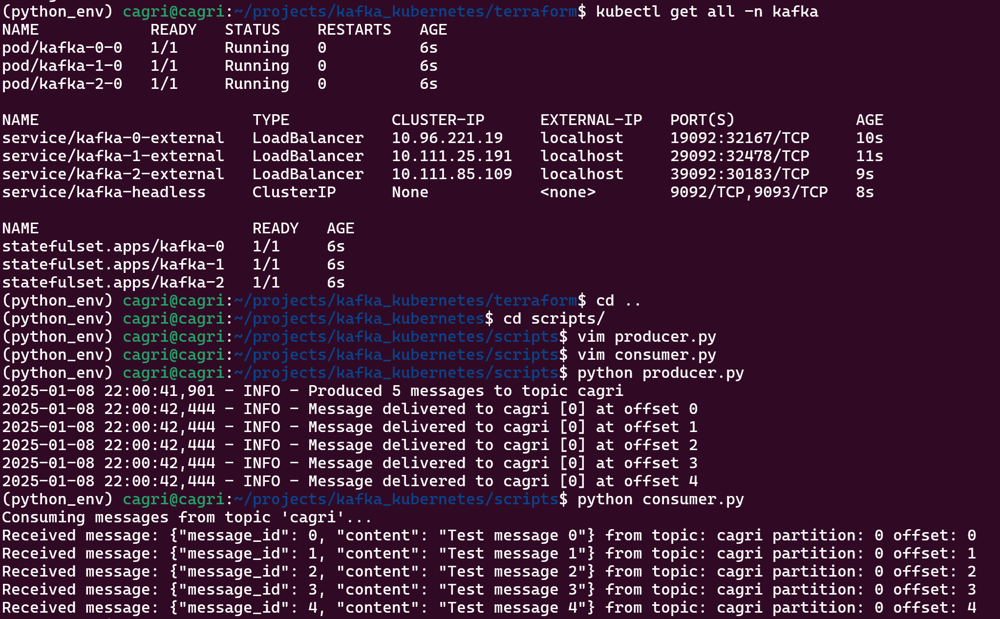

# Kafka Cluster with Terraform

This project provides a scalable, production-like Apache Kafka cluster that runs on Kubernetes, with all infrastructure provisioned and managed through Terraform. The setup allows you to easily deploy and manage a multi-broker Kafka cluster in your own Kubernetes environment, making use of best practices for cloud-native, reproducible infrastructure.

With full support for persistent storage, your Kafka data remains safe and durable, even across broker restarts or pod rescheduling. The environment also includes external port mapping, enabling access to Kafka brokers and services from outside the Kubernetes cluster for local development or integration testing.

All Terraform code and Kubernetes manifests are provided, so you can automate the deployment, scaling, and maintenance of your Kafka infrastructure. This solution is ideal for DevOps engineers, SREs, and developers who want to operate Kafka in a cloud-native way, benefiting from robust infrastructure-as-code workflows and highly reproducible operations.

---

## 🚀 Overview

- Multi-broker Kafka cluster on Kubernetes  
- All resources provisioned with Terraform (`terraform/` directory)
- Persistent storage using Kubernetes PVCs (default: local-path)
- Customizable broker ports and namespace
- Sample Python producer/consumer for easy testing
- Fault tolerance and high availability (3 brokers by default)

---

## 📂 Project Structure

```
.
├── terraform/
│   ├── main.tf          # Main Terraform config
│   ├── variables.tf     # Variables and defaults
│   ├── provider.tf      # Provider config
│   └── outputs.tf       # Outputs
├── scripts/
│   ├── consumer.py      # Python consumer example
│   └── producer.py      # Python producer example
└── README.md
```

## 🛠️ Prerequisites

- Running Kubernetes cluster (local or cloud)
- [Terraform](https://www.terraform.io/downloads.html) v1.0+
- `kubectl` configured for your cluster
- Python 3.x and `pip` (for test scripts)

---

## ⚡ Quick Start
1. **Start the stack:**
    ```bash
    docker-compose up -d --build
    ```

2. **Ensure StorageClass:**
    Check your available storage classes:
    ```bash
    kubectl get storageclass
    ```
    If `local-path` is not present, deploy it:
    ```bash
    kubectl apply -f https://raw.githubusercontent.com/rancher/local-path-provisioner/master/deploy/local-path-storage.yaml

    kubectl patch storageclass local-path -p '{"metadata": {"annotations":{"storageclass.kubernetes.io/is-default-class":"true"}}}'
    ```

3. **Deploy the Kafka Cluster:**
    ```bash
    cd terraform
    terraform init
    terraform apply
    ```

---

## ⚙️ Configuration

### Variables

Key settings can be changed in `terraform/variables.tf`:

```hcl
variable "kubernetes_namespace" {
  description = "Namespace for Kafka resources"
  type        = string
  default     = "kafka"
}

variable "broker_ports" {
  description = "External ports for each Kafka broker"
  type        = map(number)
  default     = {
    broker0 = 19092
    broker1 = 29092
    broker2 = 39092
  }
}
```

### Docker Image

Kafka brokers use the image:  
```
mucagriaktas/kafka:3.8.0
```

---

## 🔌 Accessing the Cluster

Kafka brokers are accessible from your host at:
- Broker 0: `localhost:19092`
- Broker 1: `localhost:29092`
- Broker 2: `localhost:39092`

---

## 🧪 Testing

1. **Create a topic:**
   ```bash
   kubectl exec -it kafka-0-0 -n kafka --kafka-topics.sh --create --topic test --bootstrap-server localhost:9092 --partitions 3 --replication-factor 3
   ```

2. **List topics:**
   ```bash
   kubectl exec -it kafka-0-0 -n kafka --kafka-topics.sh --list --bootstrap-server localhost:9092
   ```

3. **Run test scripts:**
   ```bash
   # Start consumer
   python scripts/consumer.py

   # In another terminal, start producer
   python scripts/producer.py
   ```

---

## Example Architecture



---